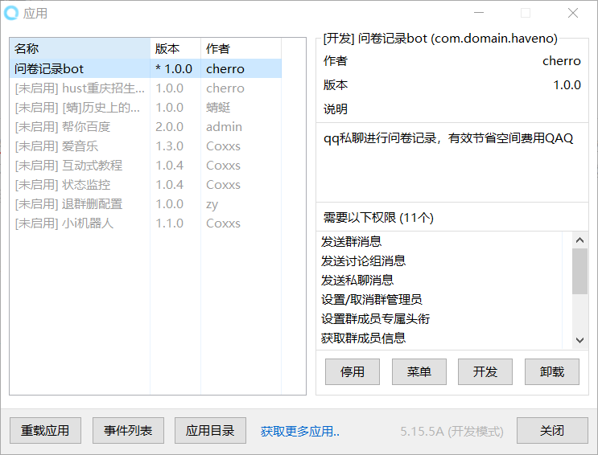

# Coolq-questionair-bot

*本bot初衷设计为通过qq机器人完成问卷填写，充分利用本地空间*

## 使用方法

### 下载对应文件

在[本页](https://github.com/cheerryio/Coolq-questionair-bott) 点击 release 标签 

下载圈出来的两个文件到本地任意位置 

### 启动酷Q机器人程序

解压 Q.Air.give.zip 文件，得到一个文件夹，进入此文件夹 如下图所示 

打开 CQA.exe文件 输入QQ账号和密码进行登录 *(尽量使用小号，本机器人会自动对私聊信息进行回复，但不会回复群聊信息)*，登录会出现异地异常登录，此为正常现象。。QAQ我还是很信任这个程序的QAQ,相信她嘻嘻. 

登录成功看到此物 

右键单击 --- 点击 应用 --- 点击 应用管理 --- 看到如下图片 

启用  问卷记录bot  至此你可以跟他交流填写问卷啦

### 配置机器人

点击菜单

进入bot配置界面。

插件成功加载后后会在data/app/com.domain.haveno目录下生成questionair.ini配置文件，如果打开出现乱码情况，

请下载vscode或者notebook 更改编码查看编辑此文件。直接对该文件进行编辑能更加深度的定制机器人的各种回复语句

数据库文件questionair.db也在 data/app/com.domain.haveno目录下,成功运行机器人即可见到此文件

这个文件

### 基本功能(默认有的功能，具体句子标识可自行配置)

用户输入 '开始填写问卷' 开始问卷模式

输入 '重置问卷' 重新填写

这是两个主要功能， 特定标志词可以自己决定。此外，可对特定消息配置特定回复

可以定制 任意一条机器人在问卷模式下说出的话话

## 关于如何配置问题请点击帮助

## 关于如何将文件导出成csv进而导出成excel请点击 导出excel方法

# 嘻嘻嘻嘻